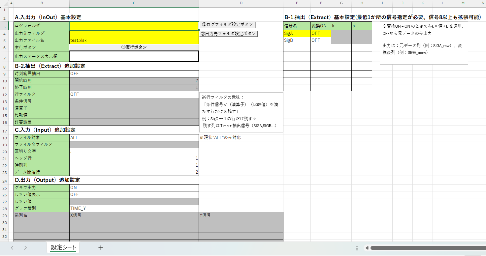

# CSV Log Extractor (Excel VBA)



CSVログから必要な信号を抽出し、単位変換およびグラフ可視化を行う

**Excel VBAベースのログ解析ツール**です。

実務の検証ログ解析を想定して設計しており、

**設定シートを変更するだけで再利用できる汎用ツール**になっています。

---

# Overview

検証ログの解析では、次のような作業が頻繁に発生します。

- 大量CSVログから必要な信号だけ取り出す
- 単位変換をかける
- 特定条件のデータだけ抽出する
- Excelでグラフ確認する

これらを手作業で行うと

- 手順が煩雑
- 再現性が低い
- 作業時間が長い

といった問題が発生します。

このツールはそれらの作業を **Excel VBAで自動化するログ解析補助ツール**です。

以下のような **wide format（横持ち形式）のCSVログ**を想定しています。

```
Time,SigA,SigB,SigC
0,1,-1,0.5
0.01,2,-2,0.6
0.02,3,-3,0.7
```

---

# Features

主な機能

### CSVログ一括処理

フォルダ内のCSVログをまとめて読み込みます。

---

### 信号抽出

必要な信号のみ抽出できます。

設定シートで信号名を指定するだけで

複数信号に対応します。

---

### 単位変換

信号ごとに

```
y = k × x + b
```

の変換を適用できます。

例

```
distance = raw_value × 0.1 + 0
```

---

### 時刻範囲抽出

指定した時刻範囲のデータのみ抽出できます。

---

### 条件行フィルタ

特定信号の条件を満たす行のみ抽出できます。

※許容誤差は `"=="` または `"!="` の場合のみ有効です。

### 例1（==）

```
条件信号 : SigC
演算子   : ==
比較値   : 1
許容誤差 : 0.01
```

この場合、次の範囲のデータを抽出します。

```
0.99 <= SigC <= 1.01
```

---

### 例2（!=）

```
条件信号 : SigC
演算子   : !=
比較値   : 1
許容誤差 : 0.01
```

この場合、次の範囲のデータを抽出します。

```
SigC < 0.99
または
SigC > 1.01
```
---

### グラフ可視化

抽出した信号をExcelグラフとして表示できます。

対応形式

- TIME-Yグラフ
- XYグラフ

---

### 進捗表示

大量ログ処理時に進捗が確認できます。

---

# Tool Structure

```
csv-log-extractor-vba
│
├ tool
│   csv_log_extractor_vba_v0.1.xlsm
│
├ sample
│   sample_log1.csv
│   sample_log2.csv
│
└ README.md
```

---

# How to Use

1. Excelツールを開く

```
tool/csv_log_extractor_vba_v0.1.xlsm
```

---

2. 設定シートを開く

---

3. 以下を設定
- A.入出力（InOut）基本設定
  - ログフォルダ(①ログフォルダ設定ボタンでも設定可能)
  - 出力先フォルダ(②出力先フォルダ設定ボタンでも設定可能)
  - 出力ファイル名(.xlsxまで記載)
- B-1.抽出（Extract）基本設定
  - 信号名(最低でも1信号必須)
  - 変換OFFもしくはON(ONの場合はk,bを設定)
- B-2.抽出（Extract）追加設定
  - 時刻範囲抽出OFFもしくはON(ONの場合は開始時刻、終了時刻を設定)
  - 行フィルタOFFもしくはON(ONの場合は条件信号、演算子、比較値、許容誤差を設定)
- C.入力（Input）追加設定
  - ヘッダ行、時刻列、データ開始行をログフォーマットに合った位置に設定
- D.出力（Output）追加設定
  - グラフ出力OFFもしくはON設定(ONの場合はしきい値設定、グラフ種別を選択)

---

4. ③実行ボタンを押す

---

5. 抽出結果がExcelに出力されます

---

# Example

サンプルログは以下に配置しています。

```
sample/sample_log1.csv
sample/sample_log2.csv
```

ツール動作確認に使用できます。

---

# Environment

- Windows
- Microsoft Excel (VBA)

---

# Use Case

想定用途

- 検証ログ解析
- 制御系ログ確認
- センサデータ解析
- テストログ可視化

---

# Future Improvements

将来的に追加予定

- CSV区切り文字自動判定
- 複雑な変換式対応
- GUI改善

---

# Author

Tetsuya

---

# License

MIT License
